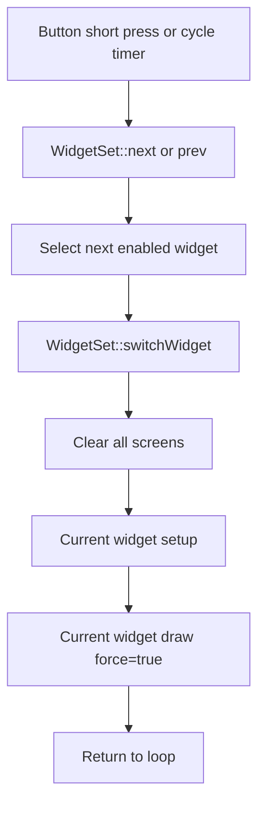
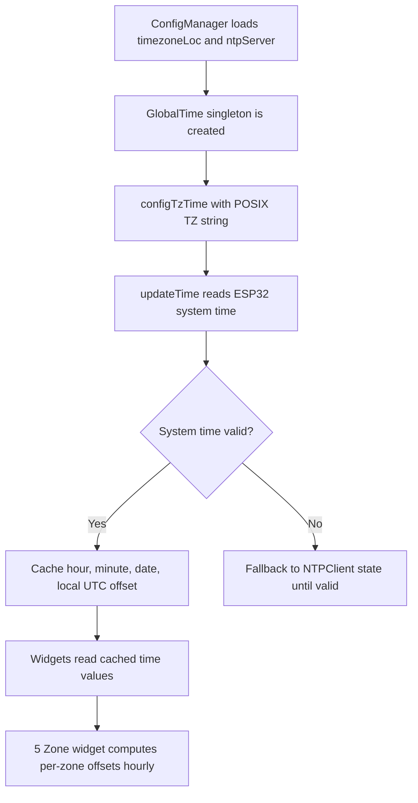
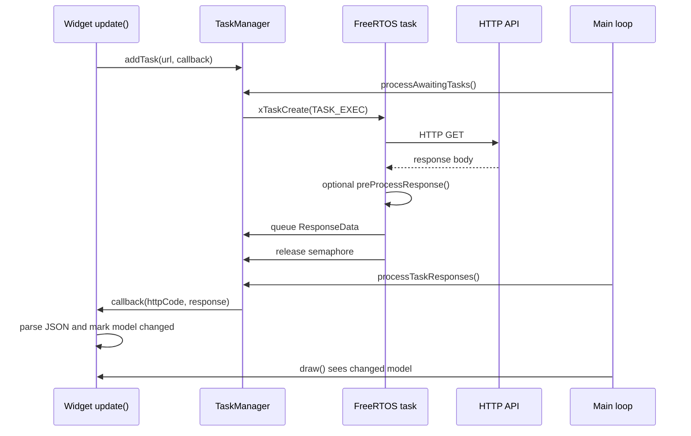

# Info Orbs Program Flow

This document describes the runtime flow for the ESP32 firmware, with emphasis on startup, watchdog-safe looping, screen switching, and asynchronous data updates.

## Startup

```mermaid
flowchart TD
    A[setup()] --> B[initializeGlobalResources]
    B --> C[Serial, logging, and last reset trace]
    C --> D[Create OrbsWiFiManager]
    D --> E[Create ConfigManager]
    E --> F[Create ScreenManager]
    F --> G[Create WidgetSet]
    G --> H[MainHelper::init and watchdog init]
    H --> I[Mount LittleFS]
    I --> J[Register config fields and load NVS values]
    J --> K[Setup buttons and interrupts]
    K --> L[Draw welcome screens]
    L --> M[Create and setup WifiWidget]
    M --> N[Create enabled widgets]
    N --> O[Create GlobalTime and force first time update]
    O --> P[Setup WiFiManager web portal]
    P --> Q[Enter loop()]
```

Notes:

- Widgets are constructed once in `addWidgets()`.
- `WidgetSet::add()` calls each enabled widget's `setup()` immediately.
- `CrashTrace::mark()` records startup milestones so the next boot can identify the last reached phase after a reset.
- `GlobalTime` configures ESP32 POSIX timezone handling and NTP. POSIX timezone rules now provide the normal local offset and DST behavior without a timezone API call.
- The WiFiManager config portal is assembled after widgets register their own config fields.

## Main Loop

```mermaid
flowchart TD
    A[loop()] --> B[Reset watchdog]
    B --> C{WiFi connected?}
    C -- No --> D[WifiWidget update]
    D --> E[WifiWidget draw]
    E --> F[Mark screens to clear on next widget draw]
    F --> Z[restartIfNecessary]
    C -- Yes --> G{Initial widget data loaded?}
    G -- No --> H[Show loading on screen 3]
    H --> I[Update all enabled widgets once]
    I --> J[Register web portal endpoints]
    G -- Yes --> K[Update GlobalTime]
    J --> K
    K --> L[Check buttons and NVS reset gesture]
    L --> M[Update current widget if due]
    M --> N[Apply time-based brightness]
    N --> O[Draw current widget if due]
    O --> P[Auto-cycle widgets if due]
    P --> R[Process WiFiManager/web portal]
    R --> S[Start one queued async task if semaphore free]
    S --> T[Apply completed task responses on main loop]
    T --> Z[restartIfNecessary]
```

Notes:

- The main task watchdog is reset at the top of every loop and at key setup checkpoints.
- If WiFi is not connected, only the WiFi widget is updated/drawn, then the normal widget screens are marked for clearing before the next widget draw.
- Initial widget data loading runs once after WiFi connects. After that, normal widget refresh timers decide when each widget updates or draws.
- `restartIfNecessary()` gives the web portal a short time to answer the save request before calling `ESP.restart()`.

## Screen Switching



Notes:

- `setup()` is called again on every screen switch.
- Widget `setup()` methods should only reset display-local state or cache pointers. Network fetches belong in `update()` to avoid duplicate requests during navigation.
- Manual button presses reset the widget auto-cycle timer. Left and right short presses move between widgets; other button events are forwarded to the active widget.

## Time And Timezone Flow



Notes:

- `GlobalTime` caches formatted time/date fields once per second unless forced.
- The 5-zone widget maps IANA timezone IDs to POSIX timezone strings, temporarily switches `TZ`, computes each zone's active UTC offset, then restores the original timezone.
- Per-zone offsets refresh hourly so DST transitions are eventually picked up without hitting an external API.

## Asynchronous HTTP Data Updates



Important ownership rules:

- Queued callbacks may run long after `update()` returns.
- Callbacks must not capture local variables by reference.
- Callbacks may safely use pointers or references to widget-owned models only when the owning widget has static application lifetime.
- Display drawing should stay on the main loop unless a library callback is explicitly known to be thread-safe.
- `TaskManager` starts at most one queued request when the semaphore is available, and response callbacks are applied from the main loop via `processTaskResponses()`.
- Widgets that still perform synchronous HTTP in their own `update()` path can block the main loop and should be treated differently from TaskManager-backed widgets.

## Reboot-Class Risks To Watch

- Dangling references in queued callbacks can corrupt memory when HTTP responses are applied.
- Blocking network or filesystem work in the main loop can starve the watchdog.
- Re-running widget `setup()` on every screen switch means `setup()` must stay idempotent.
- Large JSON parsing and `String` churn can fragment heap over time; filtered parsing and short-lived responses reduce the risk.
- Repeated display clearing, font loading, and JPEG decoding are among the most expensive draw-path operations.
- Crash breadcrumbs should be kept short and placed around expensive or reset-prone operations, because they are intended to survive into the next boot report.
