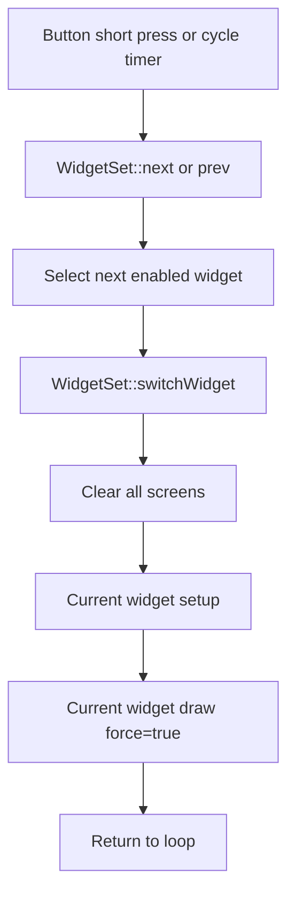
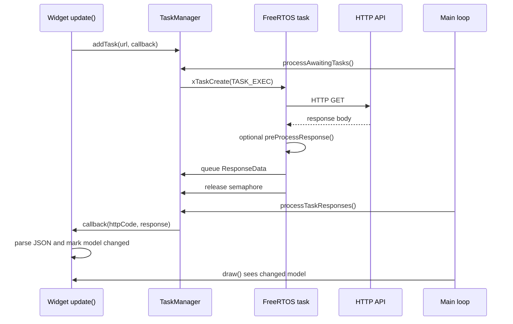

# Info Orbs Program Flow

This document describes the runtime flow for the ESP32 firmware, with emphasis on startup, screen switching, and asynchronous data updates.

## Startup

```mermaid
flowchart TD
    A[setup()] --> B[initializeGlobalResources]
    B --> C[Serial and logging]
    C --> D[Create OrbsWiFiManager]
    D --> E[Create ConfigManager]
    E --> F[Create ScreenManager]
    F --> G[Create WidgetSet]
    G --> H[MainHelper::init and watchdog init]
    H --> I[Mount LittleFS]
    I --> J[Register config fields]
    J --> K[Setup buttons and interrupts]
    K --> L[Draw welcome screens]
    L --> M[Create and setup WifiWidget]
    M --> N[Create enabled widgets]
    N --> O[Create GlobalTime and force NTP update]
    O --> P[Setup WiFiManager web portal]
    P --> Q[Enter loop()]
```

Notes:

- Widgets are constructed once in `addWidgets()`.
- `WidgetSet::add()` calls each enabled widget's `setup()` immediately.
- `GlobalTime` configures ESP32 POSIX timezone handling and NTP.

## Main Loop

```mermaid
flowchart TD
    A[loop()] --> B[Reset watchdog]
    B --> C{WiFi connected?}
    C -- No --> D[WifiWidget update]
    D --> E[WifiWidget draw]
    E --> F[Mark screens to clear on next widget draw]
    F --> Z[restartIfNecessary]
    C -- Yes --> G{Initial widget data loaded?}
    G -- No --> H[Show loading]
    H --> I[Update all enabled widgets]
    I --> J[Register web portal endpoints]
    G -- Yes --> K[Update GlobalTime]
    J --> K
    K --> L[Check buttons]
    L --> M[Update current widget if due]
    M --> N[Apply time-based brightness]
    N --> O[Draw current widget if due]
    O --> P[Auto-cycle widgets if due]
    P --> R[Process WiFiManager/web portal]
    R --> S[Start one queued async task if semaphore free]
    S --> T[Apply completed task responses]
    T --> Z[restartIfNecessary]
```

## Screen Switching



Notes:

- `setup()` is called again on every screen switch.
- Widget `setup()` methods should only reset display-local state or cache pointers. Network fetches belong in `update()` to avoid duplicate requests during navigation.

## Asynchronous HTTP Data Updates



Important ownership rules:

- Queued callbacks may run long after `update()` returns.
- Callbacks must not capture local variables by reference.
- Callbacks may safely use pointers or references to widget-owned models only when the owning widget has static application lifetime.
- Display drawing should stay on the main loop unless a library callback is explicitly known to be thread-safe.

## Reboot-Class Risks To Watch

- Dangling references in queued callbacks can corrupt memory when HTTP responses are applied.
- Pointer arithmetic on null image pointers is undefined behavior when an unknown weather icon is returned.
- Blocking network or filesystem work in the main loop can starve the watchdog.
- Re-running widget `setup()` on every screen switch means `setup()` must stay idempotent.
- Large JSON parsing and `String` churn can fragment heap over time; filtered parsing and short-lived responses reduce the risk.
